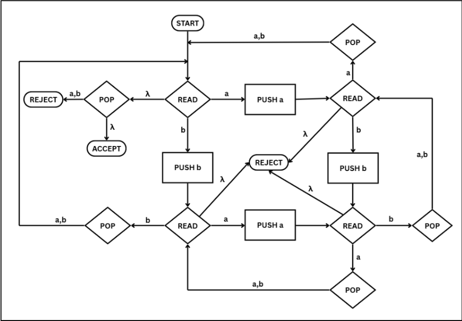

# Tugas Proyek 3 Otomata B

| Name | NRP | Pembagian Tugas |
| --- | --- | --- |
| Willy Dava Nugraha | 5025241090 | Logika PDA |
| Nyoman Surya Hutama Andyartha | 5025241093 | Mengembangkan UI |

PDA diambil dari referensi DFA pada soal mingguan 7 nomor 1 sebagai berikut:

Gambar PDA-nya sebagai berikut:

Contoh string yang bisa diterima adalah: $\lambda$ (null string), aa, abba
Contoh string yang bisa ditolak adalah: a, b, ab

UI Aplikasi PDA Simulator sebagai berikut:

